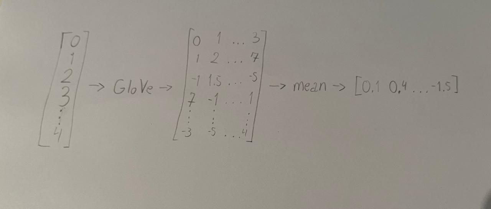

# NLP_APS2

## Step 1: find embeddings

- The dataset is a list of characters from Fate Grand/Order. Each character has a Name, ID, Rarity and Description. Only the characters with ID smaller than 361 were considered due to dataset's continuous updates.

- GloVe is used to create the pre-trained embeddings for the database with vectors of 300 dimensions. The embeddings were pooled using the mean function from torch. An MLP was employed with 3 layers, and Linear transformation with 312 hidden dimensions. 

- First the Adam optimizer is applied for 1000 epochs with learning rate $10^{-4}$. The loss function used is the CrossEntropyLoss function, since there are more than 2 classes (non-binary output dimensions in the classifier).

## Step 2: visualize your embeddings

 Pre-trained Output

 Tuned Output

- The embeddings of both figures seem to form 3 different clusters. However, the position of the clusters seems to be mirrored after tuning.

## Step 3: test the search system

The model used was saved in the Insper Super Computer "Monstrão", in the folder "APS2_model" (it is the only file there, "model.pt").
Only valid for the 2nd semester of 2024, afterwards the developer Tiago Seixas needs to be contacted to acquire the model.

- Non-obvious results: query = 'smoke'

- Less than Ten results: query = 'Santa Claus wears red on christmas eve, delivers presents, and brings joy to all children that are good. Coal to the naughty ones.', similarity > 0.7

- Ten results: query = 'A teacher is someone that helps you learn to improve yourself, to be a better person', similarity > 0.082
