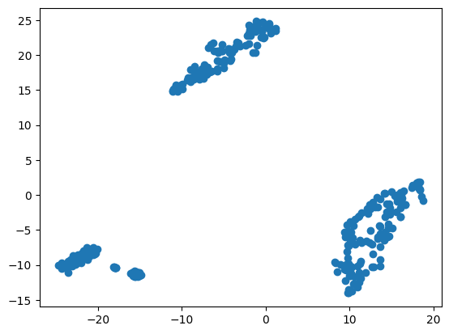

# NLP_APS2

## Step 1: find embeddings

- The dataset is a list of characters from Fate Grand/Order. Each character has a Name, ID, Rarity and Description. Only the characters with ID smaller than 361 were considered due to dataset's continuous updates.

- GloVe is used to create the pre-trained embeddings for the database with vectors of 300 dimensions. The embeddings were tuned using the mean function from torch. Multi-layering was employed with 3 layers, and Linear transformation with 312 hidden dimensions. 

- First the Adam optimizer is applied. Then, the train vector goes through the classifier. Afterwards, the CrossEntropyLoss function is used, since there are more than 2 classes (non-binary output dimensions in the classifier).

## Step 2: visualize your embeddings

 Pre-trained Output

 Tuned Output

- The embeddings of both figures seem to cluster uniformly. However, the shape of the cluster seems to be mirrored after tuning.

## Step 3: test the search system

